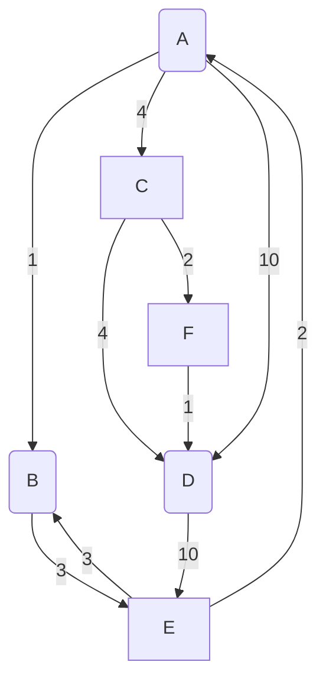

# Delivery cost application

This app calculates the order from one town to another.
The user should choose points of the route and then the app gets the result. The application has the opportunity to add stops between two nodes.

Towns was generated from graph:

